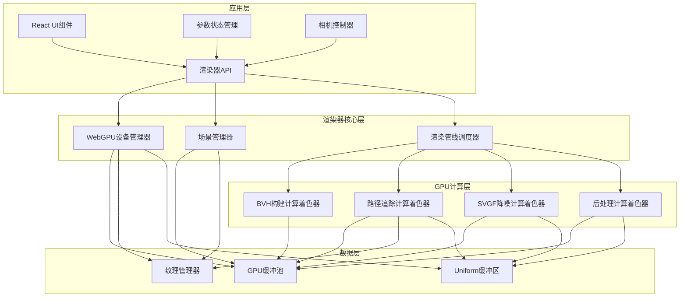

## 1. 架构设计



## 2. 技术描述

- **前端框架**: React 18 + TypeScript + Vite 5
- **WebGPU API**: 原生WebGPU API + @webgpu/types类型定义
- **状态管理**: Zustand 4 轻量级状态管理
- **UI组件**: TailwindCSS 3 + 自定义玻璃拟态组件
- **glTF加载**: 自定义glTF 2.0解析器，支持Draco压缩
- **WGSL着色器**: 所有计算逻辑使用WGSL编写
- **性能剖析**: WebGPU时间戳查询 API

## 3. 核心模块设计

### 3.1 WebGPU设备管理器 (`src/core/webgpu/DeviceManager.ts`)
- 设备创建和适配选择
- 功能特性检测（时间戳、存储缓冲绑定等）
- 错误处理和设备丢失恢复
- 全局唯一实例

### 3.2 GPU缓冲池 (`src/core/webgpu/BufferPool.ts`)
- 手动内存管理，避免频繁分配释放
- 缓冲复用池，按大小分类管理
- 读写资源屏障自动处理
- 内存使用统计

### 3.3 场景管理器 (`src/core/scene/SceneManager.ts`)
- glTF 2.0完整解析
- PBR金属粗糙度材质系统
- 多UV集纹理管理
- 骨骼动画静态快照
- 实例化变换节点管理

### 3.4 BVH构建器 (`src/core/bvh/BVHBuilder.ts`)
- GPU并行LBVH构建（Morton码排序 + 层次生成）
- PLOC++优化（并行局部操作聚类）
- SAH成本树旋转优化
- 动态场景增量重建
- 变形物体BVH重适配

### 3.5 路径追踪核心 (`src/core/pathtracer/PathTracer.ts`)
- 波前路径追踪架构
- 多重重要性采样（MIS）
- BRDF重要性采样 + HDR环境光重要性采样
- Next Event Estimation (NEE)
- 俄罗斯轮盘赌路径终止
- 透明涂层BSDF
- 次表面散射薄片近似
- 纹理双线性插值

### 3.6 SVGF降噪器 (`src/core/denoiser/SVGFDenoiser.ts`)
- 运动向量计算
- 历史缓冲重投影
- 联合双边滤波
- 非对称时间累积滤波
- 火焰和高光细节保留
- TAA抗锯齿融合

### 3.7 后处理管线 (`src/core/postprocess/PostProcessPipeline.ts`)
- 曝光调节
- ACES电影级色调映射
- Bloom效果（多尺度高斯模糊）
- 景深（圆形Bokeh）
- 色调曲线调节

### 3.8 渲染管线调度器 (`src/core/render/RenderScheduler.ts`)
- Pass依赖图管理
- 资源屏障自动插入
- 异步渲染调度
- 时间戳查询注入
- 多缓冲帧同步

### 3.9 相机控制器 (`src/core/camera/FreeCameraController.ts`)
- 自由飞行相机（WASD移动）
- 鼠标拖拽旋转视角
- 景深参数控制
- 自动曝光调节

## 4. 数据结构定义

### 4.1 GPU缓冲数据布局

```typescript
// 三角形数据 (16字节对齐)
interface Triangle {
    v0: vec3;
    v1: vec3;
    v2: vec3;
    n0: vec3;
    n1: vec3;
    n2: vec3;
    uv0: vec2;
    uv1: vec2;
    materialID: u32;
}

// BVH节点 (32字节)
interface BVHNode {
    boundsMin: vec3;
    boundsMax: vec3;
    leftChild: u32;
    rightChild: u32;
    triangleCount: u32;
    triangleStart: u32;
}

// 材质数据 (64字节)
interface PBRMaterial {
    baseColor: vec4;
    baseColorTexture: u32;
    metallic: f32;
    roughness: f32;
    metallicRoughnessTexture: u32;
    normalTexture: u32;
    occlusionTexture: u32;
    emissive: vec3;
    emissiveTexture: u32;
    clearcoat: f32;
    clearcoatRoughness: f32;
    clearcoatTexture: u32;
    transmission: f32;
    ior: f32;
    thickness: f32;
    subsurface: f32;
}

// 路径状态 (每个像素)
struct PathState {
    origin: vec3;
    direction: vec3;
    throughput: vec3;
    radiance: vec3;
    pdf: f32;
    depth: u32;
    flags: u32;
}
```

### 4.2 渲染Pass顺序

| Pass名称 | 类型 | 输入 | 输出 | 说明 |
|----------|------|------|------|------|
| BVH构建 | 计算 | 三角形数据 | BVH节点、Morton码 | 并行LBVH + PLOC++ |
| 路径追踪 | 计算 | BVH、材质、纹理 | 辐射度、法线、深度、运动向量 | 每像素多路径采样 |
| SVGF降噪 | 计算 | 辐射度、法线、深度、运动向量 | 降噪后图像 | 时空联合滤波 |
| 色调映射 | 计算 | 降噪后HDR图像 | LDR图像 | ACES + 曝光 |
| Bloom | 计算 | LDR图像 | Bloom叠加层 | 多尺度模糊 |
| 景深 | 计算 | LDR + 深度 + Bloom | 最终图像 | 圆形Bokeh采样 |
| 呈现 | 渲染 | 最终图像 | SwapChain | 输出到Canvas |

## 5. 性能优化策略

### 5.1 GPU内存优化
- 所有缓冲使用 `GPUBufferUsage.STORAGE | GPUBufferUsage.COPY_DST | GPUBufferUsage.COPY_SRC`
- 纹理使用 `GPUTextureUsage.TEXTURE_BINDING | GPUTextureUsage.COPY_DST | GPUTextureUsage.STORAGE_BINDING`
- 历史缓冲使用双缓冲乒乓结构
- 大缓冲预分配，避免运行时分配

### 5.2 计算着色器优化
- 使用 `workgroup_size(8, 8, 1)` 2D工作组
- 波前路径追踪，连续路径批处理
- 共享内存加速BVH遍历
- 指令级优化：减少分支，使用向量化操作

### 5.3 同步优化
- 所有读写使用资源屏障，避免CPU等待
- 使用 `GPUComputePassDescriptor.timestampWrites` 进行性能剖析
- 多帧重叠渲染，隐藏CPU-GPU延迟

### 5.4 BVH优化
- 64字节节点对齐，优化缓存行
- SAH成本树旋转，每帧最多1024次旋转
- 动态场景增量更新，避免全量重建

### 5.5 降噪优化
- 5×5联合双边滤波器
- 时间累积使用指数移动平均
- 运动向量加权防止重影
- 边缘检测保留高频细节

## 6. 目录结构

```
src/
├── core/
│   ├── webgpu/
│   │   ├── DeviceManager.ts
│   │   ├── BufferPool.ts
│   │   ├── TextureManager.ts
│   │   └── ResourceBarrier.ts
│   ├── scene/
│   │   ├── SceneManager.ts
│   │   ├── GLTFLoader.ts
│   │   ├── MaterialSystem.ts
│   │   └── AnimationSystem.ts
│   ├── bvh/
│   │   ├── BVHBuilder.ts
│   │   ├── LBVHConstructor.wgsl
│   │   ├── PLOCPlusPlus.wgsl
│   │   └── SAHOptimizer.wgsl
│   ├── pathtracer/
│   │   ├── PathTracer.ts
│   │   └── PathTracerKernel.wgsl
│   ├── denoiser/
│   │   ├── SVGFDenoiser.ts
│   │   ├── Reproject.wgsl
│   │   ├── BilateralFilter.wgsl
│   │   └── TemporalAccumulate.wgsl
│   ├── postprocess/
│   │   ├── PostProcessPipeline.ts
│   │   ├── Tonemap.wgsl
│   │   ├── Bloom.wgsl
│   │   └── DOF.wgsl
│   ├── render/
│   │   ├── RenderScheduler.ts
│   │   └── PerformanceProfiler.ts
│   └── camera/
│       └── FreeCameraController.ts
├── components/
│   ├── RenderCanvas.tsx
│   ├── ControlPanel.tsx
│   ├── PerformanceOverlay.tsx
│   └── SceneLoader.tsx
├── store/
│   └── useRendererStore.ts
├── shaders/
│   ├── common/
│   │   ├── math.wgsl
│   │   ├── random.wgsl
│   │   ├── brdf.wgsl
│   │   ├── bvh.wgsl
│   │   └── texture.wgsl
│   └── ...
├── types/
│   └── index.ts
├── App.tsx
└── main.tsx
```

## 7. 关键技术实现要点

### 7.1 WebGPU资源屏障管理
使用 `GPUCommandEncoder.beginComputePass()` 时通过 `timestampWrites` 记录各Pass耗时。

### 7.2 多重重要性采样(MIS)
实现平衡启发式权重计算，结合BRDF采样和光源采样的权重：
```wgsl
fn mis_weight(pdf_a: f32, pdf_b: f32) -> f32 {
    let w = pdf_a * pdf_a;
    return w / (pdf_a * pdf_a + pdf_b * pdf_b);
}
```

### 7.3 SVGF时空降噪
- 运动向量计算：前一帧相机投影 + 当前帧世界位置
- 重投影：使用运动向量查找前一帧像素
- 联合双边滤波：权重 = 空间权重 × 深度权重 × 法向权重
- 时间累积：`history = alpha * current + (1 - alpha) * history`

### 7.4 BVH构建流程
1. 计算每个三角形的Morton码（30位）
2. 基数排序按Morton码排序三角形
3. 并行构建LBVH层次
4. PLOC++局部优化聚类
5. SAH树旋转优化
6. 计算节点包围盒

## 8. 构建配置

Vite配置使用 `@webgpu/types` 类型定义，WGSL文件通过自定义插件导入。

```typescript
// vite.config.ts
export default defineConfig({
    plugins: [
        react(),
        {
            name: 'wgsl-loader',
            transform(code, id) {
                if (id.endsWith('.wgsl')) {
                    return `export default ${JSON.stringify(code)}`;
                }
            }
        }
    ],
    server: {
        headers: {
            'Cross-Origin-Opener-Policy': 'same-origin',
            'Cross-Origin-Embedder-Policy': 'require-corp'
        }
    }
});
```
